<div align="center">

# 🧙‍♀️ Ranking de Bruxas e Magos 🪄

### *Códigos, Magia e Mistérios Digitais*


---

*Um sistema místico que conecta magos e bruxas a uma interface digital, registrando pontos, protegendo segredos com criptografia segura e classificando os mais poderosos em um ranking encantado.*

[🪄 **Visão Geral**](#-sobre-o-projeto) • [⚙️ **Tecnologias**](#-tecnologias-utilizadas) • [🏗️ **Arquitetura**](#-arquitetura-do-sistema) • [🚀 **Execução**](#-instalação) • [📚 **Funcionalidades**](#-principais-funcionalidades) • [🧛 **Autores**](#-equipe)

</div>

---

## 🎯 **Sobre o Projeto**

O **Ranking de Bruxas e Magos** é um sistema de cadastro desenvolvido em **Python**, projetado para armazenar e gerenciar informações de usuários mágicos — bruxas e magos — com total segurança e praticidade.

Os dados são protegidos com **criptografia Argon2** e armazenados no **MongoDB Atlas**, um banco de dados em nuvem robusto e confiável.  
A interface é construída com **CustomTkinter**, oferecendo uma experiência visual moderna e intuitiva que permite:

- Cadastrar novos magos e bruxas 🧙‍♀️  
- Alterar informações existentes 🪶  
- Excluir registros obsoletos 💀  
- Exibir um **ranking mágico**, listando todos os cadastrados em **ordem crescente de pontos**, revelando os mais poderosos do clã.  

O projeto encontra-se **em fase final de desenvolvimento**, faltando apenas ajustes visuais e refinamentos na interface.

---

## ⚙️ **Tecnologias Utilizadas**

```
🐍 Python 3.13.0
💾 MongoDB Atlas
🪟 CustomTkinter + Tkinter
🔐 Pymongo
🧠 Argon2 (Criptografia)
```

---

## 🏗️ **Arquitetura do Sistema**

```mermaid
graph TD
    A[Interface CustomTkinter] --> B[Camada de Controle Python]
    B --> C[Pymongo]
    C --> D[MongoDB Atlas]
    A --> E[Telas de Cadastro e Ranking]
    B --> F[Validação Argon2]
    D --> G[Armazenamento Seguro de Dados]
```



## 📁 Estrutura do Projeto  

```
projetoBD4bim/
│
├── src/
│   ├── main.py          # Arquivo principal - executa a aplicação
│   ├── database.py      # Conexão e operações com o banco MongoDB
│   ├── view.py          # Interface gráfica desenvolvida com CustomTkinter
│   └── __pycache__/     # Arquivos compilados automaticamente pelo Python
│
├── assets/
│   └── images/
│       ├── mage.png     # Imagem ilustrativa de mago
│       └── witch.png    # Imagem ilustrativa de bruxa
│
├── __pycache__/         # Cache principal do projeto
│
├── LICENSE              # Licença MIT do projeto
├── README.md            # Documento com informações do projeto
└── requirements.txt     # Lista de dependências necessárias
```

---

## 🚀 **Instalação**

### **Pré-requisitos**
- Python **3.13.0** instalado  
- Conta e cluster configurados no **MongoDB Atlas**  

### **1. Clone o repositório**
```bash
git clone https://github.com/jeanmbr/projetoBD4bim.git
cd projetoBD4bim
```

### **2. Acesse o diretório**
```bash
cd projetoBD4bim
```

### **3. Instale as dependências**
```bash
pip install -r requirements.txt
```

### **4. Execute a aplicação**
```bash
python src/main.py
```

---

## 📚 **Principais Funcionalidades**

| Feitiço | Descrição |
|---------|------------|
| 🔮 **Cadastro de Bruxas e Magos** | Registra novos usuários mágicos com segurança Argon2 |
| ✏️ **Edição de Registros** | Permite modificar dados armazenados no banco |
| 💀 **Remoção de Usuários** | Exclui magos e bruxas do sistema |
| 🧙‍♂️ **Ranking Mágico** | Ordena todos os usuários de acordo com sua pontuação |
| 🔐 **Criptografia Avançada** | Protege senhas com Argon2, garantindo máxima segurança |

---

## 👥 **Equipe**

<div align="center">

**Desenvolvido com 🖤 paixão sombria por:**

- 🧙‍♂️ [@jeanmbr](https://github.com/jeanmbr)  
- 🧛 [@Doringgg](https://github.com/Doringgg)  
- 🧝 [@Caua-Macedo](https://github.com/Caua-Macedo)

---

*"Nem todo feitiço é magia... alguns são apenas boas linhas de código."* 💻✨  

</div>
